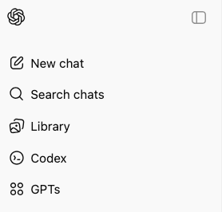

# ChatGPT Codex

ChatGPT Codex is the web interface to OpenAI's Codex coding agent. It is available for paid subscription users.

Codex is a framework layered on top of large language models (LLMs) that specializes in code reasoning, code synthesis, and code manipulation. 

## Accessing ChatGPT CodeX

Direct URL: https://chatgpt.com/codex

Through ChatGPT:

## Codex Sandbox

How Codex cloud tasks work

Under the hood, here’s what happens when you submit a task:

We prepare a containerized environment with, your repo’s code at the desired branch or sha, and your setup & maintenance scripts.
We configure internet access for the agent. Internet access is off by default, but you can configure the environment to have limited or full internet access.
The agent then runs terminal commands in a loop. It writes code, runs tests, and attempts to check its work. The agent attempts to honor any specified lint or test commands you’ve defined in an AGENTS.md file. The agent does not have access to any special tools outside of the terminal or CLI tools you provide.
When the agent is done, it presents its answer and a diff of any code it modified.
You can choose to open a PR or ask for followups.